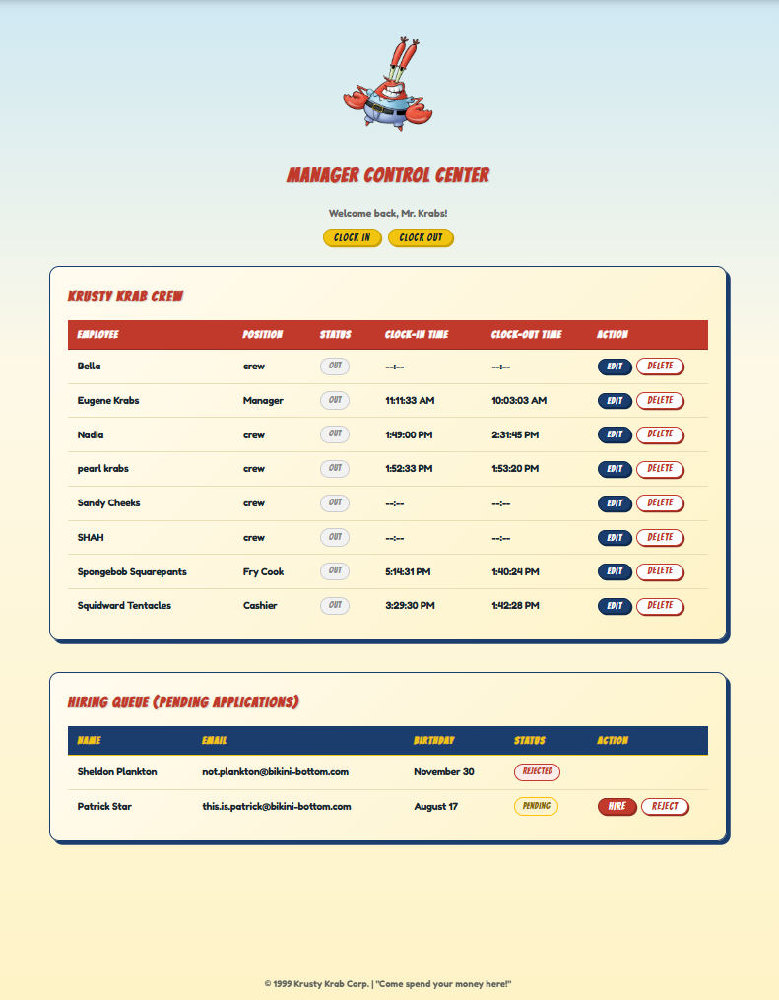
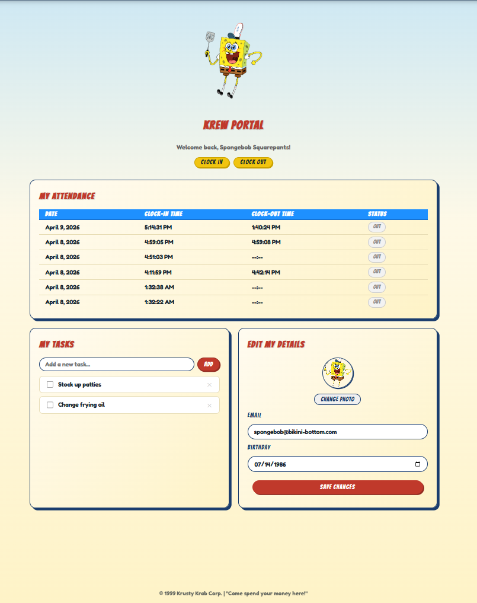

# Krusty Krab HQ

A full-stack employee management system for the Krusty Krab, built to practice JWT authentication and role-based access control in a PERN stack. Features two role-based portals — one for managers and one for crew members — with real-time attendance tracking, a hiring pipeline, and a public-facing menu and crew registry.

**Live demo:** [krusty-hq.netlify.app](https://krusty-hq.netlify.app) · Backend: [krustykrab-hq-production.up.railway.app](https://krustykrab-hq-production.up.railway.app)

---

## Screenshots




---

## Tech Stack

**Frontend:** React · Vite · React Router · Axios  
**Backend:** Node.js · Express  
**Database:** PostgreSQL (hosted on Railway)  
**Auth:** JWT · bcrypt  
**File Uploads:** Multer  
**Deployment:** Netlify (client) · Railway (server + database)

---

## Features

### Auth
- JWT login with bcrypt password hashing
- Token stored in `sessionStorage`, attached to all requests via Axios interceptor
- Auth middleware on all protected routes
- Role-based access: `Manager` vs `crew`

### Manager Dashboard
- View and edit all staff details (name, role, hourly rate, bio, birthday, email, photo)
- Hire or reject applicants from a hiring queue
- Live staff attendance monitor (auto-refreshes every 15 seconds)
- Clock in / Clock out

### Krew Portal
- Personal attendance history
- Personal todo list (add, check off, delete)
- Edit own profile — email, birthday, and profile photo upload
- Clock in / Clock out

### Public Pages
- Home with navigation cards
- Krusty Krew Registry — crew cards with individual employee detail pages
- Galley Grub Menu — tabbed by category; Managers can edit items inline
- Join the Krew application form (hidden when logged in)

---

## Project Structure

```
├── client/                  # React + Vite frontend
│   └── src/
│       ├── api/
│       │   └── axios.js         # Axios instance with auth interceptor
│       ├── assets/              # Per-page/component CSS files
│       │   ├── AdminDashboard.css
│       │   ├── CrewPortal.css
│       │   ├── CrewRegistry.css
│       │   ├── EmployeeDetails.css
│       │   ├── Menu.css
│       │   ├── Apply.css
│       │   ├── Login.css
│       │   ├── Home.css
│       │   └── Navbar.css
│       ├── components/
│       │   ├── Navbar.jsx
│       │   ├── Login.jsx
│       │   ├── EmployeeCard.jsx
│       │   ├── ApplyForm.jsx
│       │   ├── HiringQueue.jsx
│       │   ├── StaffStatus.jsx
│       │   ├── MyAttendance.jsx
│       │   ├── MyTodos.jsx
│       │   └── EditProfile.jsx
│       └── pages/
│           ├── Home.jsx
│           ├── Menu.jsx
│           ├── CrewRegistry.jsx
│           ├── EmployeeDetails.jsx
│           ├── Apply.jsx
│           ├── AdminDashboard.jsx
│           └── CrewPortal.jsx
│
└── server/                  # Express + Node.js backend
    ├── middleware/
    │   └── auth.js              # JWT verification middleware
    ├── routes/
    │   ├── auth.js              # Login
    │   ├── crew.js              # Crew routes + own profile
    │   ├── admin.js             # Applications, hiring, staff management
    │   ├── attendance.js        # Clock in/out + history
    │   ├── todos.js             # Personal todo CRUD
    │   ├── upload.js            # Staff photo upload (multer)
    │   └── public.js            # Menu, apply form
    ├── public/
    │   └── staff/               # Uploaded staff photos
    ├── db.js                    # PostgreSQL pool
    └── index.js                 # Express entry point
```

---

## Database Setup

```sql
CREATE DATABASE krusty_krab;
\c krusty_krab

CREATE TABLE staff (
  id          SERIAL PRIMARY KEY,
  name        TEXT,
  role        TEXT,
  hourly_rate NUMERIC,
  hired_at    TIMESTAMP DEFAULT NOW(),
  image       TEXT,
  bio         TEXT,
  birth_date  DATE,
  email       TEXT
);

CREATE TABLE users (
  id            SERIAL PRIMARY KEY,
  username      TEXT UNIQUE,
  password_hash TEXT,
  role          TEXT DEFAULT 'crew',
  staff_id      INTEGER REFERENCES staff(id)
);

CREATE TABLE applications (
  id         SERIAL PRIMARY KEY,
  name       TEXT,
  email      TEXT,
  birth_date DATE,
  status     TEXT DEFAULT 'pending'
);

CREATE TABLE attendance (
  id             SERIAL PRIMARY KEY,
  staff_id       INTEGER REFERENCES staff(id),
  status         TEXT DEFAULT 'active',
  clock_in_time  TIMESTAMP DEFAULT NOW(),
  clock_out_time TIMESTAMP
);

CREATE TABLE menu_items (
  id          SERIAL PRIMARY KEY,
  name        TEXT,
  description TEXT,
  price       NUMERIC,
  category    TEXT,
  image_url   TEXT
);

CREATE TABLE todos (
  id         SERIAL PRIMARY KEY,
  staff_id   INTEGER REFERENCES staff(id) ON DELETE CASCADE,
  task       TEXT NOT NULL,
  completed  BOOLEAN DEFAULT false,
  created_at TIMESTAMP DEFAULT NOW()
);
```

---

## Environment Variables

**`server/.env`**
```
DB_HOST=localhost
DB_PORT=5432
DB_USER=postgres
DB_PASSWORD=your_postgres_password
DB_NAME=krusty_krab
JWT_SECRET=your_jwt_secret
CREW_INITIAL_PW=your_default_crew_password
PORT=5000
SERVER_URL=http://localhost:5000
```

On Railway, set `DATABASE_URL` (provided automatically) and `SERVER_URL` to your Railway backend URL instead of the individual `DB_*` variables.

**`client/.env`**
```
VITE_API_URL=http://localhost:5000
VITE_CREW_INITIAL_PW=your_default_crew_password
```

On Netlify, set `VITE_API_URL` to your Railway backend URL.

---

## Getting Started

```bash
# Server
cd server
npm install
npm run dev

# Client (separate terminal)
cd client
npm install
npm run dev
```

Client: `http://localhost:5173` · Server: `http://localhost:5000`

---

## API Routes

| Method | Endpoint | Auth | Role | Description |
|--------|----------|------|------|-------------|
| POST | `/auth/login` | — | — | Login, returns JWT |
| GET | `/crew` | — | — | All staff |
| GET | `/crew/:id` | — | — | Single staff member |
| GET | `/crew/me` | ✅ | Any | Own profile |
| PATCH | `/crew/me` | ✅ | Any | Update own email, birthday, photo |
| GET | `/menu` | — | — | All menu items |
| PUT | `/menu/:id` | ✅ | Manager | Edit menu item |
| POST | `/apply` | — | — | Submit job application |
| GET | `/admin/applications` | ✅ | Manager | All applications |
| PATCH | `/admin/applications/:id/status` | ✅ | Manager | Reject application |
| POST | `/admin/hire` | ✅ | Manager | Hire applicant, create user account |
| GET | `/admin/staff-status` | ✅ | Manager | Staff + live attendance status |
| PUT | `/admin/staff/:id` | ✅ | Manager | Edit staff details |
| DELETE | `/admin/staff/:id` | ✅ | Manager | Delete staff member |
| GET | `/attendance/my` | ✅ | Any | Own attendance records |
| POST | `/attendance/clock-in` | ✅ | Any | Clock in |
| POST | `/attendance/clock-out` | ✅ | Any | Clock out |
| GET | `/todos` | ✅ | Any | Own todos |
| POST | `/todos` | ✅ | Any | Add todo |
| PATCH | `/todos/:id/toggle` | ✅ | Any | Toggle complete |
| DELETE | `/todos/:id` | ✅ | Any | Delete todo |
| POST | `/upload/staff-photo` | ✅ | Any | Upload staff photo |

---

## Key Concepts Practiced

- JWT authentication flow end-to-end (issue, store, attach, verify)
- Role-based route protection on both frontend (conditional render + redirect) and backend (middleware)
- Multipart file upload with Multer, serving static files via Express
- Cross-origin deployment — React on Netlify consuming an Express API on Railway
- Dual database connection config supporting `DATABASE_URL` (Railway) and individual env vars (local)
- Component-level CSS organisation and mobile-first responsive design
